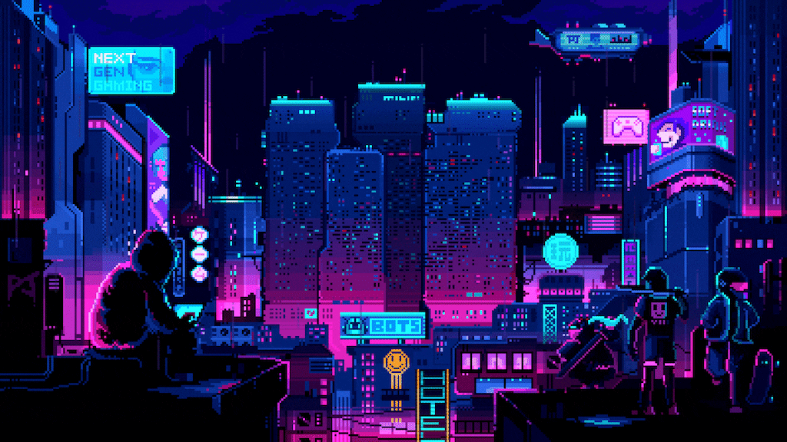

 
<h1 align="left">
Hi 👋, I'm Mustafa Yusuf Daşdemir 
 
</h1>

 

<code><i>"<!-- DAILY_FACT_START -->Game engines handle rendering, physics, and input systems.<!-- DAILY_FACT_END -->"</i></code>  

  

---
 

## 🕹️ About Me
- 🎓 Computer Engineering student at **Bursa Technical University**  
- 🎮 Interested in **game development** with **Unity & C#**  
- 🌱 Developing an **Pixel art farming game** as a personal project  
- 🚀 Motivated to improve in **game design, programming, and problem-solving**  
- 🌍 Open to collaboration and always learning new technologies  

---

## ✍️ Medium Posts 
<!-- MEDIUM_POSTS_START -->
- [Unity İle Oyun Geliştirmeye Giriş](https://medium.com/@MustafaYusufDasdemir/unity-i%CC%87le-oyun-geli%C5%9Ftirmeye-giri%C5%9F-0b3146b70c1e?source=rss-ae344f912ba5------2) — Önceki yazımda oyun motorları ve oyun geliştirmeye nereden ve nasıl başlanacağından bahsetmiştim, bu yazımda ise...
- [Oyun Geliştirmeye Nereden Başlamalıyım?](https://medium.com/@MustafaYusufDasdemir/oyun-geli%C5%9Ftirmeye-nereden-ba%C5%9Flamal%C4%B1y%C4%B1m-a446097ea4c9?source=rss-ae344f912ba5------2) — Hepimiz hayatımız boyunca sayısız oyun oynadık: FPS’ler, yarış oyunları, RPG’ler ya da platformer’lar… Peki hiç “Bu...
<!-- MEDIUM_POSTS_END -->

---

<h3 align="center">🛠 Languages and Tools</h3>

 

&nbsp;&nbsp;

&nbsp;&nbsp;

&nbsp;&nbsp;

&nbsp;&nbsp;

&nbsp;&nbsp;

&nbsp;&nbsp;

  
 
---

<h3 align="center">🌐 Connect with me</h3>

  

&nbsp;&nbsp;

&nbsp;&nbsp;

&nbsp;&nbsp;

